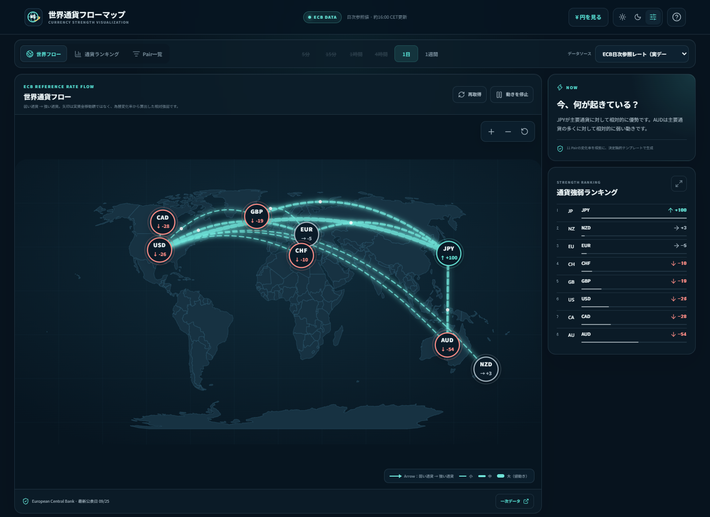
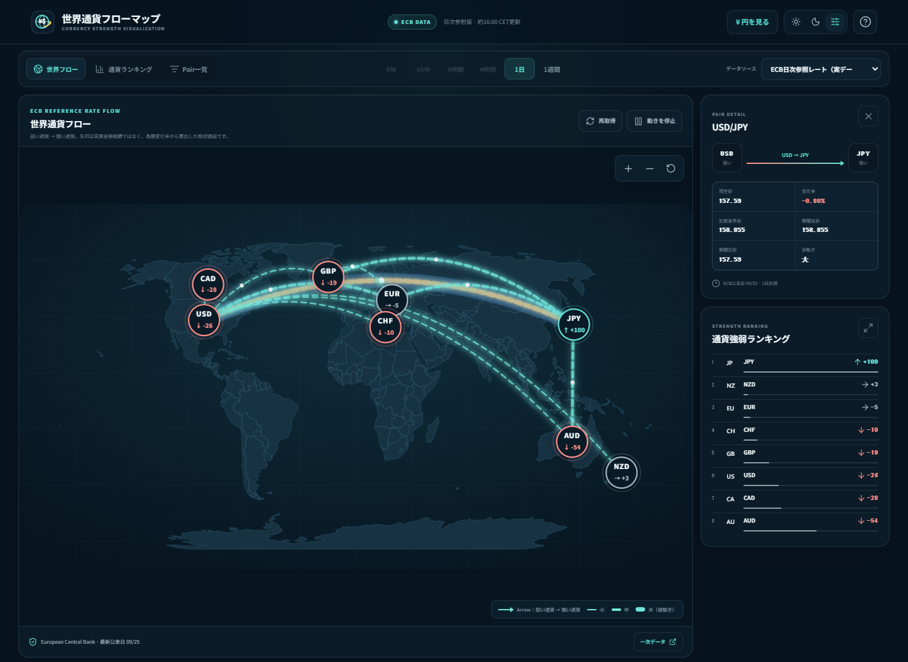
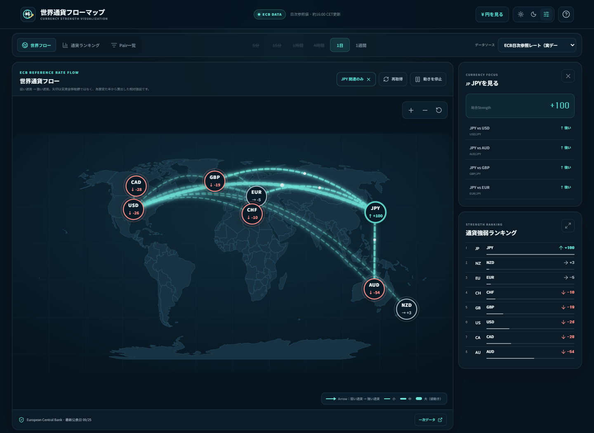
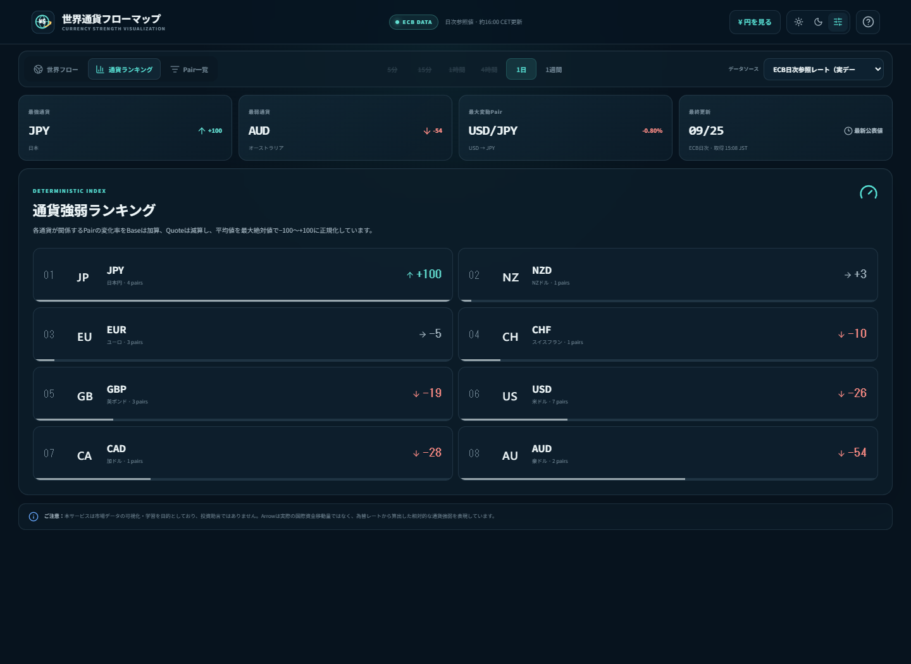
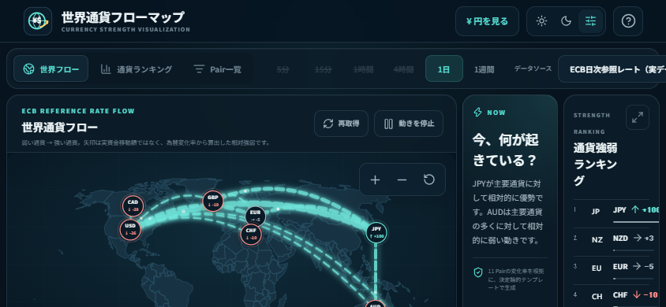

# 世界通貨フローマップ

主要通貨の相対的な強弱を、実世界の地理情報と「弱い通貨 → 強い通貨」へ流れるAnimated Arrowで直感的に読むWebアプリです。

- Production: <https://world-currency-flow-map.vercel.app>
- GitHub: <https://github.com/shunsoco-stack/world-currency-flow-map>
- Data status: **European Central Bank（ECB）日次参照レート / 実データ**

> [!IMPORTANT]
> Arrowは実際の国際資金移動量ではありません。為替レートの変化率から算出した、相対的な通貨強弱・値動きの方向を表現しています。本アプリは市場データの可視化・学習を目的としており、投資助言ではありません。

## Overview

数字やチャートを一つずつ比較しなくても、世界地図を見るだけで「どの通貨が強く、どの通貨が弱いか」を数秒で把握できる体験を目指しました。たとえばUSD/JPYが+1.20%なら、JPYからUSDへ太いArrowを描き、`JPY → USD`、`USD優勢`、`USD/JPY +1.20%`を同じ画面で確認できます。

## Concept

- 実際の国境を使った世界地図を主役にする
- 変化率の符号から、必ず「弱い通貨 → 強い通貨」を決定する
- Arrowの太さと速度を値動きの大きさに連動させる
- 色だけに依存せず、通貨コード・数値・`↑ / ↓`を併記する
- 実データとDemoを明確に分離し、Providerが未対応の時間足は無効化する
- 起動直後から地図を表示し、横画面ではファーストビューを地図中心に最適化する

## Currency Flowの意味

`USD/JPY +1.20%`は、Base CurrencyのUSDがQuote CurrencyのJPYに対して上昇したことを意味します。そのため表示方向は `JPY → USD` です。反対に`USD/JPY -1.00%`なら `USD → JPY` になります。

Arrowの方向・太さ・粒子Animationは「実資金フロー」や「資金量」ではなく、相対的な強さと値動きの大きさを視覚化したものです。将来、国際資金フロー統計を追加する場合はFX Strengthと別Layerに分離します。

## Currency Strength Calculation

Strength ScoreはAI生成ではなく、選択TimeframeのPair変化率から決定論的に算出します。

1. 各Pairの変化率を、Base Currencyへ加算、Quote Currencyから減算します。
2. 各通貨について、関係するPairの寄与を平均します。
3. 全通貨の最大絶対平均を基準に、`round(raw / max(|raw|) × 100)`で`-100〜+100`へ正規化します。
4. Score順にRankingとNodeを更新します。`+5`超を`↑`、`-5`未満を`↓`、その間を`→`とします。

例：`USD/JPY +1.20%`はUSDへ`+1.20`、JPYへ`-1.20`を寄与させます。計算式はアプリ右上のHelpからも確認できます。

### Arrow rules

| 項目 | ルール |
| --- | --- |
| Direction | 弱い通貨 → 強い通貨 |
| 細い | `abs(変化率) ≤ 0.25%` / 2.25px |
| 中 | `0.25% < abs(変化率) ≤ 0.75%` / 4.5px |
| 太い | `abs(変化率) > 0.75%` / 7.5px |
| Speed | `max(1.4, 4.4 - min(abs(変化率), 1.5) × 1.8)`秒 |

Thresholdとstroke widthは[`src/lib/market-data/config.ts`](src/lib/market-data/config.ts)で変更できます。

## Supported Currencies

USD、JPY、EUR、GBP、CHF、AUD、CAD、NZDの8通貨に対応しています。各Nodeには国・地域、通貨コード、Strength Score、方向記号を表示します。

## Supported Pairs

`USD/JPY`、`EUR/USD`、`GBP/USD`、`USD/CHF`、`AUD/USD`、`USD/CAD`、`NZD/USD`、`EUR/JPY`、`GBP/JPY`、`AUD/JPY`、`EUR/GBP`の11 Pairです。

## Timeframes

実データはECBの公表頻度に合わせ、**1日**と**1週間**に対応します。1日は直近2営業日の公表値、1週間は直近6営業日の先頭と末尾を比較します。ECBが提供していない5分、15分、1時間、4時間は実データModeでは無効化し、Fake Dataを実相場として表示しません。

Demo Modeでは5分、15分、1時間、4時間、1日、1週間の6種類を切り替えられます。

## Demo Mode

API Keyなしで次の3 Scenarioを体験できます。

1. ドル全面高・円全面安
2. 円全面高
3. EUR中心

画面上部へ常時`DEMO`と`実相場ではありません`を表示し、固定データを実相場として扱いません。Timeline / Play Modeでは09:00、11:00、13:00、14:32の4 snapshotをPrevious / Play / Pause / Next / Speed操作で再生できます。

## Real Data Provider

Productionの初期表示には[European Central Bank Data Portal](https://data.ecb.europa.eu/data/datasets/EXR)の公式日次参照レートを使用しています。ECBがEUR基準で公表するUSD、JPY、GBP、CHF、AUD、CAD、NZDの値から11 Pairをクロス計算します。API Keyは不要で、取得はNext.jsのserver-side Providerだけから行い、Frontendへ秘密情報を露出しません。

`MarketDataProvider` interfaceで`getQuote`、`getChange`、`getHistory`を定義し、UIとProviderを分離しています。レスポンスはserver-sideで1時間cacheし、画面には「リアルタイム」ではなく「日次参照値・約16:00 CET更新」と正確に表示します。取得失敗時は画面を壊さず、理由を表示したうえでDemoへFallbackします。

最終公表日を常時表示し、営業日ベースで1日を超えて更新されていない場合は「データ更新遅延」、週末は「市場休場」と表示します。

## Architecture

```text
Market Data Provider (ECB server-side / Demo)
  ↓
Quote / Historical Data
  ↓
Percentage Change + safe number guard
  ↓
Currency Strength Engine
  ↓
Relative Direction + Flow Intensity Engine
  ↓
Visualization State
  ↓
Natural Earth World Map + Currency Nodes + Animated Flow
  ↓
Filter / Pair Detail / Ranking / Historical Playback
```

計算ロジックは`src/lib/market-data`、表示は`src/components`へ分離しています。将来Gold、Bitcoin、Ethereum、原油、債券、株式Indexを追加する場合も、未実装Assetを現在のUIへ表示せず、データ型とLayerを拡張する方針です。

## Map / Visualization

- `world-atlas`のNatural Earth由来110m TopoJSONを`topojson-client`で変換
- `d3-geo`のNatural Earth projectionで実世界の国境を描画
- 8 Currency Node、最大11 Flow、最大8 animated particleに制限
- Zoom、Pan、Reset、Arrow選択、Currency Filter、JPY Focus
- Tab非表示、ユーザーPause、`prefers-reduced-motion`でAnimationを停止
- Mobileは「地図を操作」を押した時だけgestureを地図へ渡し、Page Scrollとの競合を防止
- PWA Manifestはlandscapeを要求。通常ブラウザの縦画面では非妨害の回転案内を表示

## Main Features

- 世界フロー / 通貨ランキング / Pair一覧の3 mode
- 最強・最弱・最大変動Pair・最終更新のDashboard Summary
- 11 Pairから算出するCurrency Strength Ranking
- Node選択による関連Arrow highlightとJPY比較Panel
- 現在値・変化率・始値・高値・安値・最終更新・強弱通貨を示すPair Detail
- 変化率、Strength、通貨名によるPair一覧sort
- 決定論的な「今、何が起きている？」summary
- Light / Dark / System、Reduced Motion、Keyboard、Screen Reader対応
- Web App Manifest、standalone表示、専用SVG icon
- ECB実データの1日 / 1週間、Demoの6 Timeframeと4時点Timeline / Play Mode

## Screenshots

### 1. 世界通貨フローマップ全体



### 2. USD/JPY Pair Detail



### 3. JPY Focus / Currency Filter



### 4. Currency Strength Ranking



### 5. Mobile



## Tech Stack

- Next.js 16.3 / React 19 / TypeScript
- D3 Geo / topojson-client / world-atlas
- CSS Modules / Lucide Icons
- Vitest / Playwright / ESLint
- Vercel Production

## Testing

```bash
npm run lint
npm run typecheck
npm test
npm run build
npm run screenshots -- https://world-currency-flow-map.vercel.app
```

VitestではUSD/JPYの正負方向、ECB CSV / cross-rate、Percentage Change、Strength、Arrow Threshold、Ranking、6 Timeframe、Currency Filter、3 Demo Scenario、Stale、Market Closed、API Error fallback、Reduced Motionを検証します。PlaywrightではProductionの5画面を操作・撮影し、Desktop / Tablet / Landscape Mobile / Portrait Mobileの横溢れ、Mobile map gesture、Console / Page / Request errorを検査します。

## Deployment

Vercel Productionへ公開しています。

- <https://world-currency-flow-map.vercel.app>

ECB ProviderはAPI Key不要です。将来のkey-based Provider向けの`.env*`とVercel設定はGit管理対象外です。

## Known Limitations

- ECB参照レートは営業日ごとの情報提供用データで、tick配信・Streaming・取引レートではありません。
- 実データの時間足は1日 / 1週間のみです。短時間足とTimelineは明示されたDemo内だけで利用できます。
- TimelineはDemo内の4 snapshotで、経済イベントLayerは未実装です。
- Stale判定は平日を数える簡易方式で、TARGET休業日などECB固有の祝日カレンダーは扱いません。
- 通常ブラウザは端末の向きを強制できません。PWAはlandscapeを要求し、縦画面では回転案内と縦向けResponsive UIを提供します。
- PWAはManifest / icon / standaloneに対応していますが、offline cache用Service Workerは未実装です。
- Arrowは相対的なFX strengthであり、注文量、出来高、国際資金移動額を示しません。
